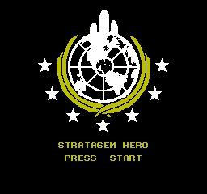
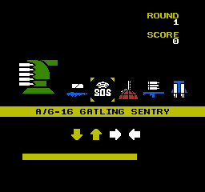
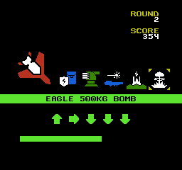
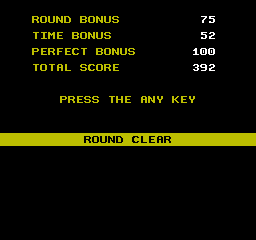

# NES Stratagem Hero

FOR DEMOCRACY!

This ROM uses the MMC5 NES mapper, so it should work in pretty much any
emulator.  I've tested this to work on real hardware.

## Building from Source

You'll need:

- GNU Make
- [cc65](https://github.com/cc65/cc65)
- Golang (optional)
- [go-nes](https://github.com/zorchenhimer/go-nes) (optional)
- [Aseprite](https://www.aseprite.org) (optional)

Golang, go-nes, and Aseprite are optional.  Golang is used to generate some
lookup tables, while go-nes and Aseprite are used to generate the CHR image
data.  The output of these steps are included in this repo to make building
possible without these dependencies.

To build from source just:

    $ git clone https://github.com/zorchenhimer/stratagem-hero.git
    $ cd stratagem-hero
    $ make

After this, you'll have the file `bin/stratagem-hero.nes` than you can load up
in your favorite NES emulator.
